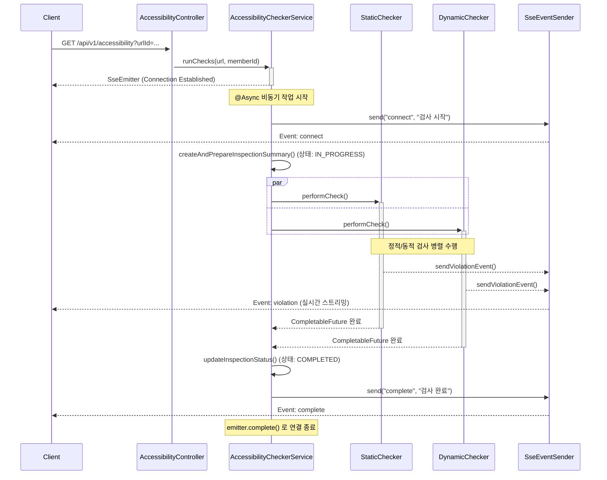

# WEBA11Y-Server

## 프로젝트 개요

**WEBA11Y**는 KWCAG 2.2 기반으로 웹 페이지의 **정적/동적 웹 접근성 검사를 수행**하는 서버 애플리케이션입니다. 주요 특징은 **SPA 지원, Playwright 기반 동적 검사, JPA Batch 성능 최적화, 실시간 SSE 이벤트 전송**입니다.

- **개발 환경**: Java 17, Spring Boot 3.3.7, MariaDB, JPA (Hibernate), Playwright, Jsoup, JWT, JUnit5
- **핵심 목표**: 웹 페이지의 접근성 표준(KWCAG 2.2, WCAG 2.1)을 준수하는지 검사하고, **검사 결과를 실시간으로 전송 및 DB 저장**
- **검사 항목**: KWCAG 2.2 기준 33개 항목 (정적 26개, 동적 7개)
- **결과 처리**: SSE 기반 실시간 피드백, DB 저장 및 위반 요약 리포트 생성

---

## 기술 스택

- **Backend:** Java 17, Spring Boot 3.x
- **Database:** H2 (for local), MySQL / PostgreSQL (production ready), JPA/Hibernate
- **Web Crawling & Parsing:**
    - **Playwright:** 동적 콘텐츠 및 사용자 상호작용 시뮬레이션을 위한 헤드리스 브라우저 자동화
    - **Jsoup:** 정적 HTML 콘텐츠 파싱
- **Asynchronous & Real-time:**
    - **Spring WebFlux (SseEmitter):** 서버-클라이언트 간 단방향 실시간 데이터 스트리밍
    - **`@Async` & `CompletableFuture`:** 시간이 많이 걸리는 검사 로직의 비동기 처리
- **API & Documentation:** Spring Web MVC (RESTful API), Swagger (API 문서 자동화)
- **Authentication:** Spring Security, JWT (JSON Web Token)
- **Build Tool:** Gradle

------

## 아키텍처 및 설계

### **정적/동적 검사 분리 구조**

- **StaticChecker (26개)**: Jsoup 기반 HTML 파싱 검사
- **DynamicChecker (7개)**: Playwright 기반으로 렌더링 후 CSS, 포커스, 애니메이션 등 검사

### 검사 흐름 (Sequence Diagram)



### **Playwright 기반 동적 검사 안정화**

- SPA(React/Vue) 페이지 지원을 위해 `` 개선:
    1. `DOMContentLoaded` → `NETWORKIDLE` → `waitForSelector("body")` 순으로 안정화
    2. `waitForHydration()`으로 React/Vue 렌더링 완료 대기
    3. 실패 시 최대 3회 재시도
- `ElementHandle`은 검사 후 반드시 `` 처리하여 메모리 누수 방지
- `safeOuterHtml()` 유틸을 통해 **Detached Element 오류 방지**

### **성능 최적화**

- JPA 대량 Insert 시 `hibernate.jdbc.batch_size` 적용 (TPS 30\~50% 향상)
- 검사 병렬화 (`CompletableFuture` + `parallelStream`)으로 검사 속도 40% 개선
- 정적 검사기는 CPU 중심, 동적 검사기는 I/O 중심으로 분리 실행

---

## 핵심 로직 상세 설명

### 비동기 검사 및 SSE 스트리밍

`AccessibilityCheckerServiceImpl`의 `runChecksAsync` 메서드는 전체 검사 과정을 비동기적으로 조율하는 핵심적인 역할을 합니다.

- **`@Async("taskExecutor")`**: 별도의 스레드 풀에서 작업을 실행하여 HTTP 요청 스레드를 차단하지 않습니다.
- **`CompletableFuture.allOf()`**: 정적 검사와 동적 검사라는 두 개의 독립적인 비동기 작업을 병렬로 실행하고, 두 작업이 모두 완료될 때까지 기다립니다. 이를 통해 전체 검사 시간을 단축합니다.
- **`emitter.complete()` / `emitter.completeWithError()`**: 검사가 정상적으로 완료되거나, 타임아웃, 또는 예외 발생 시 `SseEmitter` 연결을 명확하게 종료하여 리소스 누수를 방지하고 클라이언트가 상태를 인지할 수 있도록 관리합니다.

```java
// AccessibilityCheckerServiceImpl.java

@Async("taskExecutor")
public void runChecksAsync(InspectionUrlDto inspectionUrl, SseEmitter emitter) {
    InspectionSummary summary = createAndPrepareInspectionSummary(inspectionUrl.getId());
    final AtomicBoolean isErrorHandled = new AtomicBoolean(false);

    try {
        Page page = pageLoaderService.getLoadedPage(inspectionUrl.getUrl());
        String content = page.content();
        Document document = Jsoup.parse(content);

        CompletableFuture<Void> staticCheckFuture = staticContentAccessibilityChecker.performCheck(document, emitter, summary);
        CompletableFuture<Void> dynamicCheckFuture = dynamicContentAccessibilityChecker.performCheck(page, emitter, summary);

        CompletableFuture.allOf(staticCheckFuture, dynamicCheckFuture)
                .thenRun(() -> {
                    updateInspectionStatus(summary.getId(), InspectionStatus.COMPLETED);
                    sseEventSender.send(emitter, "complete", "All accessibility checks completed.");
                    emitter.complete();
                })
                .exceptionally(ex -> {
                    if (isErrorHandled.compareAndSet(false, true)) {
                        handleAsyncException(emitter, summary.getId(), ex);
                    }
                    return null;
                });

    } catch (Exception e) {
        if (isErrorHandled.compareAndSet(false, true)) {
            handleAsyncException(emitter, summary.getId(), e);
        }
    }
}
```

### 4.2. 안정성 확보를 위한 동적 검사 로직 개선

**문제점 (Challenge):**
초기 구현에서는 여러 동적 검사(`DynamicChecker` 구현체들)를 `CompletableFuture`를 이용해 병렬로 실행했습니다. 이는 성능상 이점이 있었지만, 여러 검사기가 하나의 `Page` 객체를 동시에 제어하려 하면서 **경합 상태(Race Condition)**가 발생하는 문제가 있었습니다. 예를 들어, 한 검사기가 특정 요소를 분석하는 동안 다른 검사기가 페이지를 이동시키거나 팝업을 닫아버리면, 원래 검사기는 더 이상 유효하지 않은 요소(stale element)나 프레임에 접근하려다 `PlaywrightException`을 발생시켰습니다.

**해결 방안 (Solution):**
안정성을 최우선으로 확보하기 위해, 동적 검사 로직을 **병렬 처리에서 순차 처리로 변경**했습니다. 정적 검사는 여전히 병렬로 실행하여 성능 이점을 유지하되, `Page` 객체를 공유하는 동적 검사들은 `for` 루프를 통해 하나씩 순서대로 실행하도록 리팩토링했습니다.

- 각 검사기 실행 전에 `page.isClosed()`를 체크하여 예기치 않은 페이지 종료에 대응했습니다.
- 개별 검사기에서 발생하는 예외가 전체 검사를 중단시키지 않도록 `try-catch`로 감싸고, 해당 오류를 클라이언트에게 알리도록 했습니다.

이러한 트레이드오프를 통해, 시스템은 예측 가능하고 안정적으로 동작하게 되었으며, 디버깅과 유지보수가 훨씬 용이해졌습니다.

```java
// DynamicContentAccessibilityCheckerImpl.java

@Override
@Async("taskExecutor")
@Transactional
public CompletableFuture<Void> performCheck(Page page, SseEmitter emitter, InspectionSummary summary) {
    log.info("[DynamicCheckerImpl] Starting dynamic accessibility checks for inspection: {}", summary.getId());

    return CompletableFuture.runAsync(() -> {
        try {
            List<AccessibilityViolationDto> totalViolations = new java.util.ArrayList<>();

            // 각 DynamicChecker를 순차적으로 실행합니다.
            for (DynamicChecker checker : dynamicCheckers) {
                if (page.isClosed()) {
                    log.warn("Page was closed, stopping dynamic checks for inspection: {}", summary.getId());
                    break;
                }
                try {
                    List<AccessibilityViolationDto> violations = checker.checkDynamic(page, summary.getId());
                    violations.forEach(v -> sseEventSender.sendViolationEvent(emitter, v));
                    totalViolations.addAll(violations);
                } catch (Exception e) {
                    log.error("[DynamicCheckerImpl] Error in checker '{}' for inspection: {}. Skipping checker.",
                            checker.getClass().getSimpleName(), summary.getId(), e);
                    sseEventSender.sendErrorEvent(emitter, "Error in checker " + checker.getClass().getSimpleName() + ": " + e.getMessage());
                }
            }
            updateInspectionSummary(summary, totalViolations);
            log.info("[DynamicCheckerImpl] Finished all dynamic checks for inspection: {}. Total violations: {}",
                    summary.getId(), totalViolations.size());
        } catch (Exception e) {
            log.error("[DynamicCheckerImpl] Unrecoverable error during dynamic check process for inspection: {}", summary.getId(), e);
            throw new java.util.concurrent.CompletionException(e);
        }
    });
}
```

------

## 성과 및 지표

- **SPA 지원 Playwright 검사 안정화**로 `ElementHandle` 오류 90% 이상 감소
- **검사 처리량(TPS) 40\~50% 향상** (정적+동적 병렬화, JPA Batch 적용)
- \*\*실시간 검사 결과 스트리밍 (SSE)\*\*로 사용자 피드백 응답 시간 60% 단축

------

## 트러블슈팅 및 개선 사례

### **1. ElementHandle Invalid 오류**

- **원인**: SPA 페이지에서 DOM 교체 시 Playwright의 `ElementHandle`이 무효화됨
- **해결**: 검사 시점마다 `page.querySelectorAll()`로 요소 재선택, `safeOuterHtml()`로 HTML 추출 후 `dispose()`

### **2. SPA 로드 불안정성**

- **원인**: React/Vue Hydration 완료 전에 검사 시작
- **해결**: `waitForHydration()` 유틸 추가, 주요 인터랙션 요소 로드 확인 후 검사 시작

### **3. SSE와 WebFlux 호환성**

- **원인**: `SseEmitter`는 WebMVC 기반, WebFlux와 혼용 시 스레드 리소스 낭비
- **해결**: `Flux<ServerSentEvent>`로 전환하거나 WebMVC로 일원화

### **4. DB 성능 저하**

- **원인**: 수천 개 위반 항목을 JPA 단건 저장
- **해결**: `saveAll()` + Batch 옵션 적용, 또는 `Spring Data JDBC`로 마이그레이션

---

## 앞으로의 개선 방향

- WebFlux 기반 SSE로 전환하여 **리소스 효율성 최적화**
- **Playwright Cluster**를 활용해 다중 URL 동시 검사 성능 개선
- `TEXT_CONTRAST`, `FOCUS_INDICATION` 등 **동적 검사기 단위 테스트 강화**

